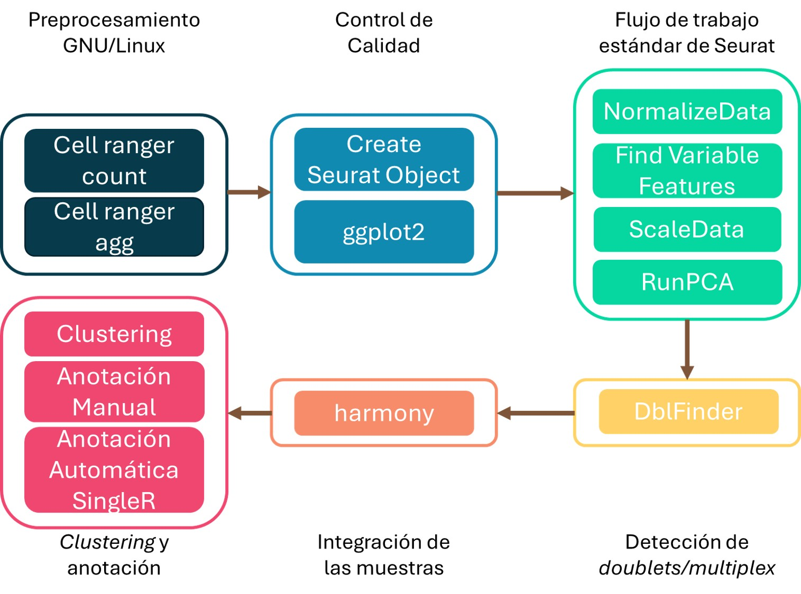

# scRNA-seq
This project contains all automatomatic scripts to perform the full data analysis from the sparse matrix to annotated clusters in R.

The pipeline to analyze scRNA-seq data is reported in: 

# 🧬 Automatic QC for scRNA-seq Data

This repository contains the R function **`automatic_qc_scrnaseq()`**, designed to perform **automated quality control (QC)** on single-cell RNA-seq (scRNA-seq) data using **Seurat** objects.

---

## 📘 Overview

`automatic_qc_scrnaseq()` takes as input a **list of Seurat objects** (each representing one sample) and:
- Computes QC metrics such as number of genes, UMIs, mitochondrial gene ratio, and transcriptome complexity.
- Exports combined metadata tables.
- Generates individual and combined QC plots.
- Returns the updated list of Seurat objects with new metadata columns.

---

## ⚙️ Usage Example

```r
# Example
qc_results <- automatic_qc_scrnaseq(
  list_srn = list(sample1 = seurat_obj1, sample2 = seurat_obj2),
  where_to_save = "~/Results/QC_scRNAseq/",
  specie = "hsa"
)

# Access updated metadata
head(qc_results[[1]]@meta.data)
```

---

## 📂 Output Structure

When executed, the function creates a new folder named:

```
Quality_Control_YYYY-MM-DD/
│
├── Combined_Metadata.xlsx
├── Plot_Interpretation_Notes.xlsx
├── Individual_Figures/
│   ├── Number_Cells_per_Sample.png
│   ├── Density_Plot_UMI_per_Cell_Per_Sample.png
│   ├── Density_Plot_Genes_Detected_per_Cell_Per_Sample.png
│   ├── Boxplot_Genes_Detected_per_Cell.png
│   ├── Scatterplot_Genes_VS_UMIs.png
│   ├── Density_Plot_MitoRatio.png
│   └── Density_Plot_Complexity.png
└── QC_Figures.png
```

---

## 📊 Example of the Final QC Figure

Below is an example of the combined QC visualization generated by the function:


---

## 🧩 Requirements

The following R packages are required (installed automatically if missing):

- `Seurat`
- `SeuratObject`
- `ggplot2`
- `dplyr`
- `patchwork`
- `openxlsx`

External helper scripts:
- `print_centered_note_v1.R`
- `create_sequential_dir.R`
- `automate_saving_dataframes_xlsx_format.R`
- `Automate_Saving_ggplots.R`

---

## 👨‍🔬 Author

**Raúl** – Bioinformatician  

---

## 📖 Reference

For theoretical background and QC interpretation, see:  
[Harvard Chan Bioinformatics Training: QC for scRNA-seq](https://hbctraining.github.io/scRNA-seq_online/lessons/04_SC_quality_control.html)
